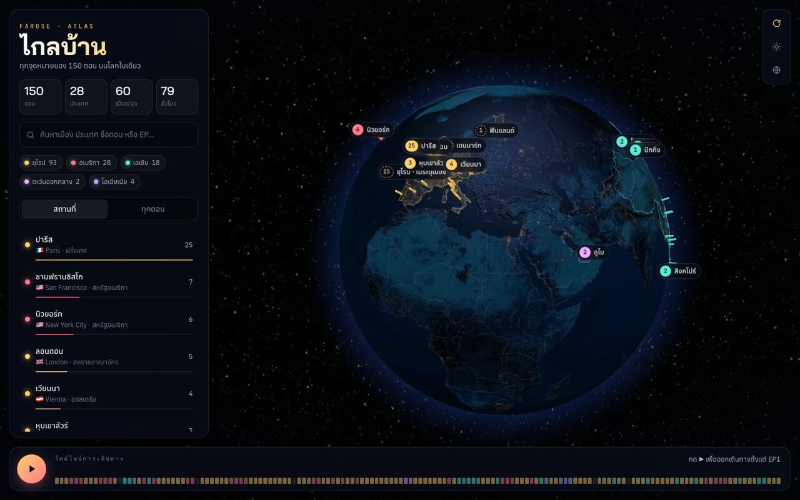
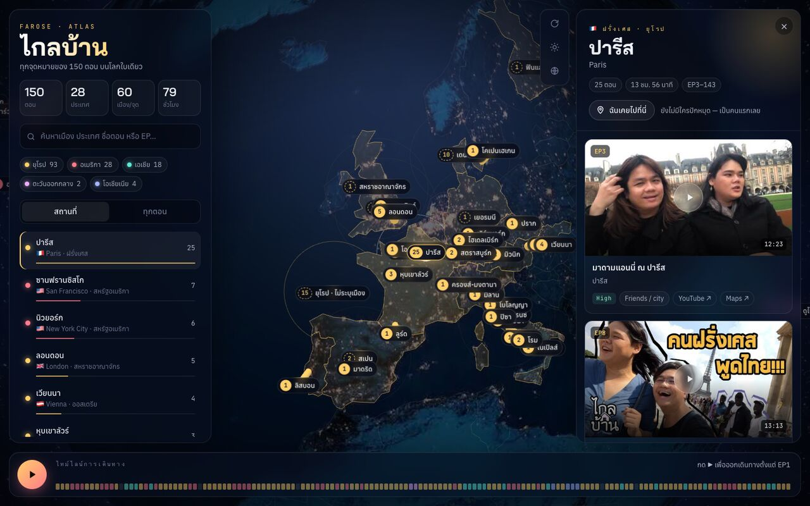
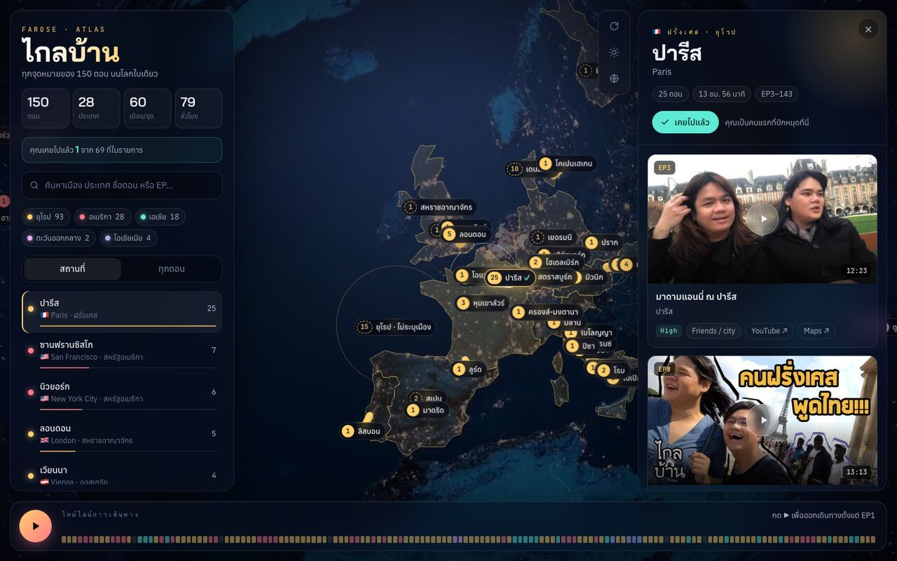
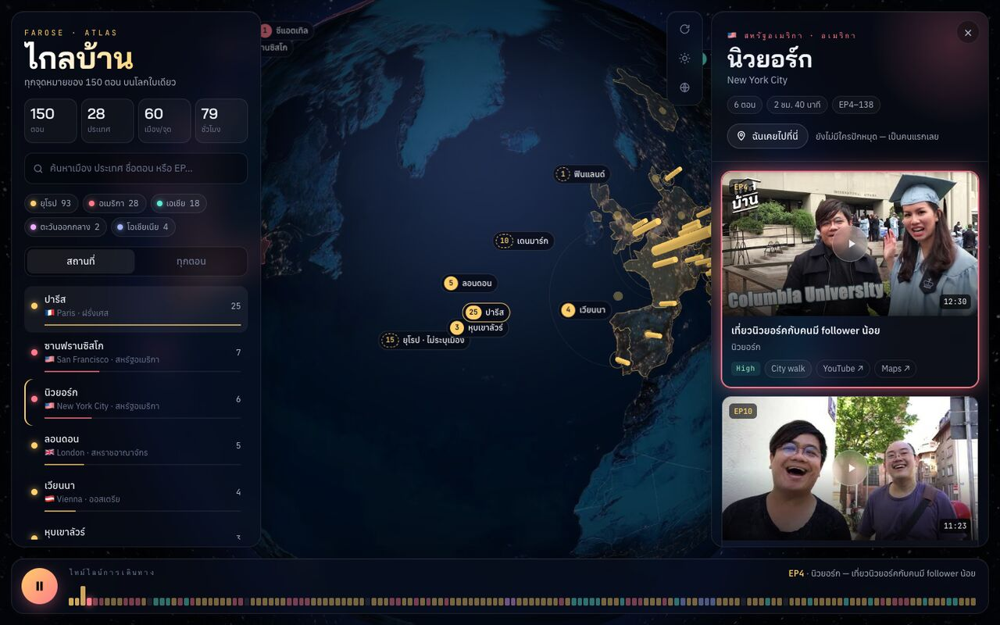
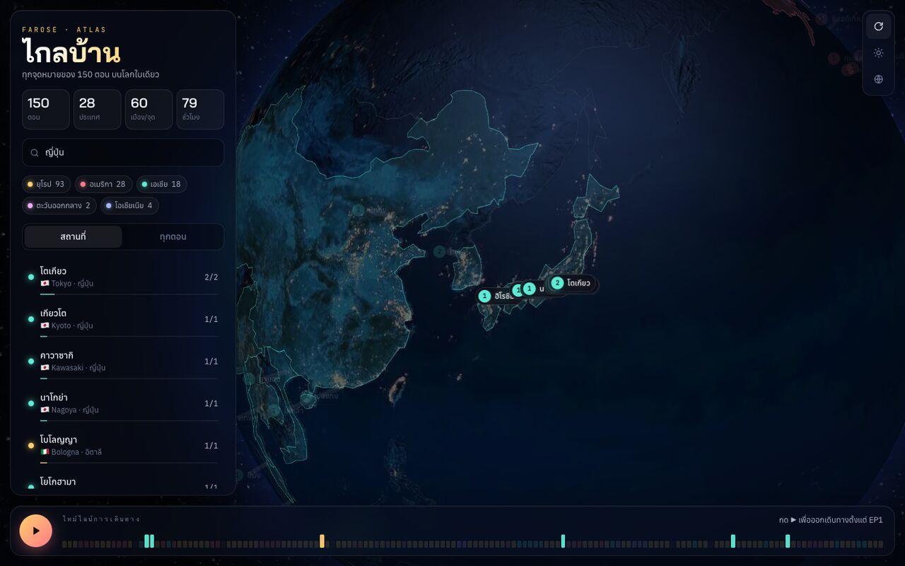
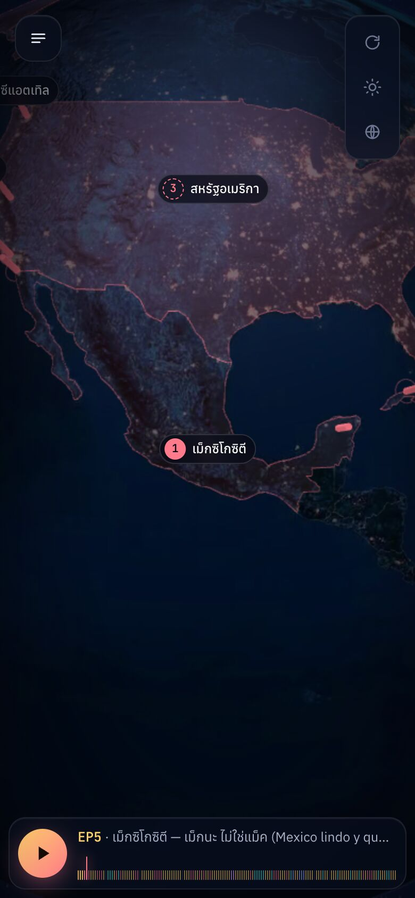
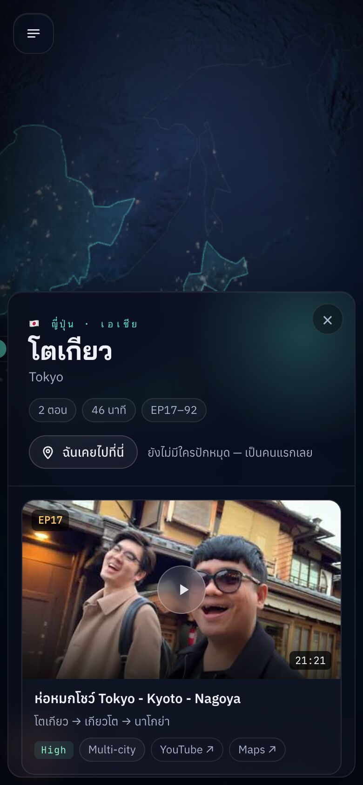

# ไกลบ้าน Atlas — แผนที่โลกของรายการ FAROSE

แผนที่โลกสามมิติแบบ Google Earth ที่ปักหมุดทุกสถานที่ในรายการ **ไกลบ้าน (FAROSE)** บน YouTube ทั้ง 150 ตอน 28 ประเทศ ในหน้าเว็บเดียวเต็มจอ

🌏 **เว็บไซต์:** https://farose-fable.web.app



## ฟีเจอร์

### 🌍 ลูกโลก 3 มิติ
- ลูกโลก WebGL ภาพแสงไฟยามค่ำคืน พร้อมภาพนูนของภูเขา กดสลับเป็นภาพกลางวันได้
- แต่ละสถานที่เป็นแท่งเรืองแสง ยิ่งมีหลายตอนแท่งยิ่งสูง พร้อมวงคลื่นกระเพื่อมและป้ายชื่อภาษาไทย
- ประเทศที่รายการเคยไปจะมีสีอ่อน ๆ ตามทวีป คลิกประเทศเพื่อดูทุกตอนในประเทศนั้น
- ป้ายชื่อเมืองเล็กจะซ่อนไว้ก่อน และปรากฏเมื่อซูมเข้าไปใกล้ ๆ

### 📍 รายละเอียดสถานที่และดูคลิปในหน้าเดียว
คลิกหมุดหรือรายชื่อเมือง ลูกโลกจะบินไปยังที่นั้น และแสดงทุกตอนที่ถ่ายที่นั่นพร้อมภาพปก ความยาว และลิงก์ Google Maps กดเล่นคลิปได้ทันทีโดยไม่ต้องออกจากหน้า



### ✅ "ฉันเคยไปที่นี่"
แฟน ๆ กดปักหมุดสถานที่ที่ตัวเองเคยไปได้ ไม่ต้องล็อกอิน
- หมุดของคุณจำไว้ในเบราว์เซอร์ ป้ายบนลูกโลกจะมีเครื่องหมาย ✓ และมีแถบบอกว่าเคยไปแล้วกี่ที่จากทั้งหมด
- ทุกสถานที่แสดงจำนวนคนที่เคยไปรวมจากทุกคน (เก็บใน Cloud Firestore)



### ▶️ ออกเดินทางตามไทม์ไลน์
แถบด้านล่างคือทั้ง 150 ตอนเรียงตามลำดับ สีตามทวีป กด ▶ หรือ Space เพื่อให้ลูกโลกบินพาเที่ยวตั้งแต่ EP1 ไปเรื่อย ๆ



### 🔎 ค้นหาและกรอง
ค้นด้วยชื่อเมือง ประเทศ ชื่อตอน หรือเลข EP ได้ทั้งภาษาไทยและอังกฤษ หมุดที่ไม่ตรงจะจางลง และไทม์ไลน์จะไฮไลต์ตอนที่ตรง กดชิปทวีปเพื่อซ่อนหรือแสดงทวีปนั้นได้



### 📱 ใช้บนมือถือได้
บนจอเล็ก รายการจะกลายเป็นลิ้นชักด้านข้าง และรายละเอียดจะเลื่อนขึ้นจากด้านล่าง

<p>
  
  
</p>

### ⌨️ คีย์ลัดและลิงก์
| ปุ่ม | ทำอะไร |
|---|---|
| `Space` | เริ่ม/หยุดการเดินทาง |
| `←` `→` | ตอนก่อนหน้า/ถัดไป |
| `/` | ไปที่ช่องค้นหา |
| `Esc` | ปิดคลิปหรือแผงรายละเอียด |

ลิงก์ตรงไปยังตอนใดก็ได้ด้วย `#ep-เลขตอน` เช่น https://farose-fable.web.app/#ep-79

## ความแม่นยำของตำแหน่ง

ข้อมูลต้นทางไม่มีพิกัด จึงกำหนดพิกัดเองตามชื่อเมือง/สถานที่ของแต่ละตอน
- **36 ตอน** ระบุจุดเฉพาะ เช่น หอไอเฟล
- **71 ตอน** ปักที่ใจกลางเมือง
- **23 ตอน** รู้แค่ประเทศ ปักที่กลางประเทศ (หมุดแบบเส้นประ)
- **15 ตอน** รู้แค่ว่าอยู่ในยุโรป รวมไว้ที่หมุด "ยุโรป · ไม่ระบุเมือง"
- **5 ตอน** (EP14, 30, 50, 112, 119) ปักหมุดไม่ได้ จะอยู่ในแท็บ "ทุกตอน" เท่านั้น

ถ้าเจอตำแหน่งที่ผิด แก้ได้ใน `scripts/build_data.py` (ดูด้านล่าง)

## โครงสร้างโปรเจกต์

```
index.html            หน้าเว็บ (หน้าเดียว)
style.css             หน้าตาทั้งหมด
app.js                ลูกโลก, แผงต่าง ๆ, ไทม์ไลน์, ฉันเคยไปที่นี่
data.js               ข้อมูลตอนและพิกัด (สร้างจากสคริปต์ ห้ามแก้มือ)
vendor/globe.gl.min.js  globe.gl 2.46.1 (รวม three.js)
assets/               ภาพพื้นผิวโลก (WebP), เส้นแบ่งประเทศ, ภาพแชร์
data/farose-gsheet.csv  ข้อมูลต้นทางจาก Google Sheet
scripts/build_data.py สร้าง data.js จาก CSV พร้อมตารางพิกัด
firestore.rules       กฎความปลอดภัยของตัวนับ "ฉันเคยไปที่นี่"
firebase.json         ตั้งค่า Firebase Hosting
docs/screenshots/     ภาพประกอบ README
```

ไม่มีขั้นตอน build และไม่ต้องติดตั้ง npm ไลบรารีทั้งหมดอยู่ในโปรเจกต์แล้ว (ยกเว้นฟอนต์จาก Google Fonts และ Firebase SDK ที่โหลดทีหลังจาก gstatic)

## รันบนเครื่อง

```bash
python3 -m http.server 5173
```
แล้วเปิด http://localhost:5173

## อัปเดตข้อมูลตอน

1. Export Google Sheet เป็น CSV แล้ววางทับ `data/farose-gsheet.csv`
2. ถ้ามีเมืองใหม่ เพิ่มพิกัดในตาราง `C` (เมือง) หรือ `P` (สถานที่เฉพาะ) และชื่อไทยใน `TH` ภายใน `scripts/build_data.py`
3. สร้าง `data.js` ใหม่
   ```bash
   python3 -I scripts/build_data.py data/farose-gsheet.csv > data.js
   ```

## Deploy

ต้องติดตั้ง [Firebase CLI](https://firebase.google.com/docs/cli) และล็อกอินด้วยบัญชีที่เข้าถึงโปรเจกต์ `farose-fable` ได้

```bash
firebase deploy                        # เว็บ + กฎ Firestore
firebase deploy --only hosting         # เฉพาะเว็บ
firebase deploy --only firestore:rules # เฉพาะกฎ
```

เมื่อแก้ `app.js`, `style.css` หรือ `data.js` ให้เพิ่มเลข `?v=` ใน `index.html` ด้วย เพื่อให้ผู้ใช้ได้ไฟล์ใหม่ทันที

## ตัวนับ "ฉันเคยไปที่นี่" ทำงานอย่างไร

- เก็บใน Firestore ที่ `places/{รหัสสถานที่}` มีฟิลด์เดียวคือ `count` (ฐานข้อมูลอยู่ที่สิงคโปร์ `asia-southeast1`)
- ไม่มีการล็อกอิน กฎใน `firestore.rules` จึงยอมให้เขียนได้แค่เพิ่มหรือลดทีละ 1 ห้ามลบ และห้ามติดลบ
- ข้อจำกัด: คนที่ตั้งใจจะปั่นตัวเลขยังทำได้ ถ้าเว็บเริ่มดังควรเพิ่ม Firebase App Check หรือ Anonymous Auth
- `apiKey` ใน `app.js` เป็นค่าสาธารณะของเว็บแอป Firebase ไม่ใช่ความลับ สิ่งที่ป้องกันข้อมูลคือกฎของ Firestore

## เครดิต

- เนื้อหาและคลิปทั้งหมดเป็นของรายการ **ไกลบ้าน (FAROSE)** บน YouTube
- ลูกโลกด้วย [globe.gl](https://globe.gl) และ [three.js](https://threejs.org)
- ภาพพื้นผิวโลกจาก NASA Blue Marble / Black Marble (ผ่านตัวอย่างของ three-globe)
- เส้นแบ่งประเทศจาก [Natural Earth](https://www.naturalearthdata.com)
